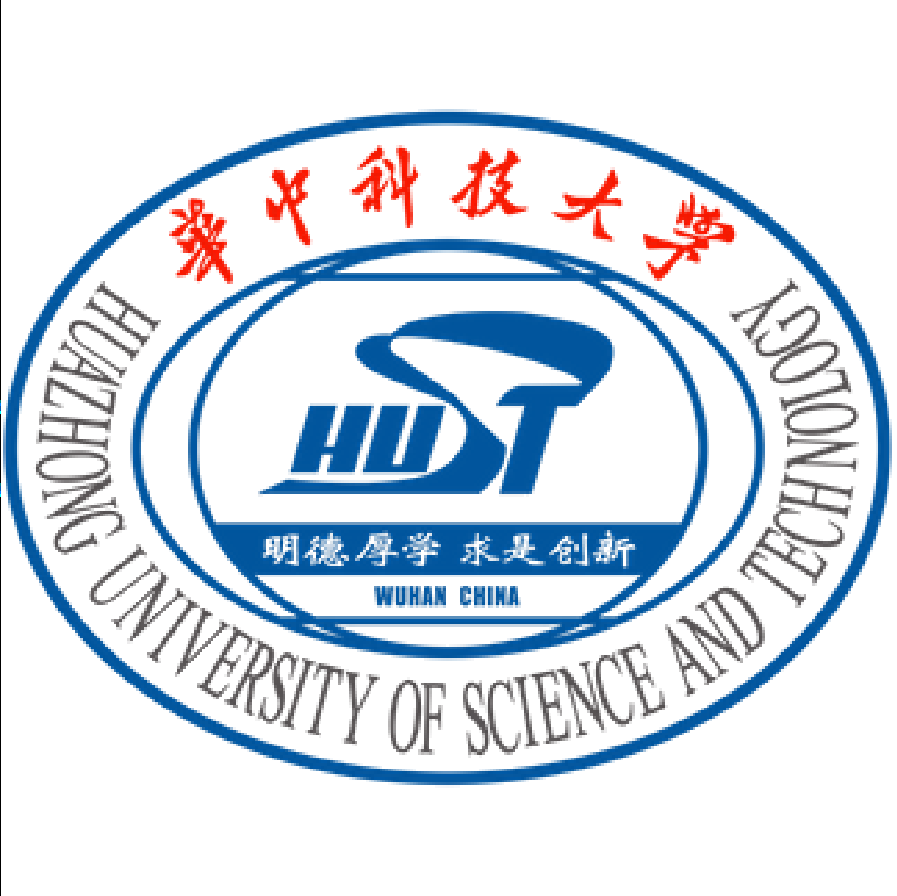

<h1 align="center"> This is the homepage for Yoghurt.(葛世寅)</h1>

# About Me
Still a student 😌 and will graduate at ==2023==. I am insterested in <u>Machine Learning/Deep Learning</u>, <u>Geographical Information Retrieval</u>, <u>Representation Learning</u>, <u>Spatial Analysis</u>. I'm looking for a chance to get rich overnight 👀

Contact me via 📮<u>geshiyin@foxmail.com</u>

If you want to know more about me, please see my resume [[English Version]](../files/paper1.pdf) or [[Chinese Version]](../files/paper1.pdf)

Education 🏫
======

  <ul>
  <li>2020.09 - Today </li>
  2nd-year M.S. at <a href="http://www.cnic.cas.cn/">Computer Network Information Center, Chinese Academy of Sciences</a>, supervised by <i>Prof</i>. <a href="http://cnic.cas.cn/sourcedb_cnic_cas/zw/zjrc/dsdw/202107/t20210702_6125764.html">Yangang Wang</a> and focus on Deep Learning and Spatial Analysis.  
  GPA: <b>3.87</b>/4.00
  </ul>
  

  <ul>
  <li>2016.09 - 2020.06 </li>
  Receive the Bachelor degree of Electrical Engineering in <a href="http://qiming.hust.edu.cn/">Qiming College</a>, <a href="http://ei.hust.edu.cn/">EIC</a>, <a href="https://www.hust.edu.cn/">HUST</a>.  
  Weighted score: <b>86.82</b>/100
  </ul>
  

Publication 📑
======
- *DeepSSN: a deep convolutional neural network to assess spatial scene similarity* Danhuai Guo,**Shiyin Ge**\*, Shu Zhang, Song Gao, Ran Tao, Yangang Wang **Transactions in GIS** 2022. [[Paper](https://arxiv.org/abs/2202.04755)]  [[Github](https://github.com/yoghur/Spatial-Query-by-Sketch)]
- ==*waiting for more papers to be accepted* 😭==

Awards 
======
- Merit Student in School of Computer Science and Technology, University of Chinese Academy of Sciences
- Outstanding Undergraduate Graduates of HUST
- National Endeavor Fellowship of HUST
- New Student Scholarship of HUST
- Outstanding Student Cadres of HUST

Project 🔨
======
- China Collegiate Computing Contest ([CCCC](http://www.appcontest.net/)) 2019.
Second prize in the **final**, [[App](https://appsuke.com/cn/%E8%A7%86%E5%94%B1%E8%BE%BE%E4%BA%BA/)] available at Apple Store.
- BeiBei Seed Cup Competition 2017.
Rank **11**/1000, Code on [[Github](https://github.com/yoghur/Seed_Cup_TextCNN)]
- Digital Signal Processing course design.
MATLAB MUSIC PLAYER, Code on [[Github](https://github.com/yoghur/Matlab_music)]
- TI Cup&Hardware Course Design.
ROS LIDAR ROBOT, Second Price of HUST[[Demo Video]](https://www.youtube.com/watch?v=5dkFqs9U06Y) [[Github]](https://github.com/yoghur/LiDAR_ros_Robot)
- Digital Circuits Course Design.
RUBIK’S CUBE ROBOT, [[Demo Video]](https://www.youtube.com/watch?v=lwa5qByJMJc)
- Circuit Principle Course Design.
MUSIC VISUALIZER CIRCUT, [[Demo Video]](https://www.youtube.com/watch?v=e310kDNNbSg)

Experience
=======
- 2021.9 - Today
**Twin Mountain Smart Construction Site - Active Prevention and Control Safety Early Warning System(Major project in Shanghai)**.Mainly responsible for the code of the map function in the webpage